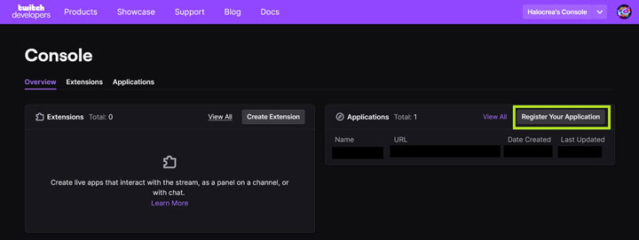
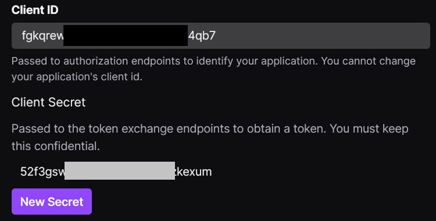

<h1 align="center">Halo Stream Overlay with Discord & Twitch integration</h1>
<p align="center">
  
  
  
  <a href="https://choosealicense.com/licenses/gpl-3.0/" target="_blank">
    
  </a>
  
  <br />
  <a href="https://discord.gg/74UAq84" target="_blank">
    
  </a>
  <a href="https://twitter.com/HaloCreation" target="_blank">
    
  </a>
</p>
A webapp providing Halo-themed overlays you can add as browser sources in OBS. It can shows the people in a Discord voice chat and display alerts whenever the channel gets a new follower or subscriber.

--- 

## Table of Content

|              |                                                                     |
| ------------ | ------------------------------------------------------------------- |
| Please read  | [Disclaimer](#disclaimer)                                           |
| Please read  | [⚠️ Important ⚠️](#important)                                       |
| **Required** | [1. Setting up the Discord Bot](#discord-bot)                       |
| *Optionnal*  | [2. Setting up the Twitch App](twitch-app)                          |
| **Required** | [3. Installing & Running the project](#installation)                |
| *Optionnal*  | [4. Updating the project](#update)                                  |
| *Optionnal*  | [5. Building a Docker Image](#docker)                               |
| *Optionnal*  | [6. Serving the webapp with Traefik on Docker](#serve-with-traefik) |
|              | [7. Credits](#credits)                                              |
|              |                                                                     |

---
## Disclaimer <a name="disclaimer"></a>
- Because of how Twitch works, if you want to get the Last Follower in real-time, you must host this app on a server. If you don't care about this, you can run it locally (see below).  
- This webapp runs on NodeJS, so if you plan on running it locally, you will need to install it: [download](https://nodejs.org/en/).
- While you can get the sources directly from the [Releases](https://github.com/Halocrea/halocrea-stream-overlay/releases) page, we would recommend you to use [Git](https://git-scm.com/downloads) instead. This way, it will be easier to update the project whenever we release a new version (let's say when Infinite comes out for example 😜 ).

This may all sound scary if you're not familiar with development, but don't worry, we'll guide you step by step, with screenshots and everything!

Also, feel free to contact us on our [Discord](https://discordapp.com/invite/74UAq84) server if you'd like some help.

---
## ⚠️ Important ⚠️ <a name="important"></a>
Before installing the app (locally or on a server), you will need to setup a Discord bot and a Twitch app (if you care about the Twitch features). It may sound complicated, but it's not and will require only about 15 to 20 minutes to get done. 

---

## 1. Setting up the Discord Bot <a name="discord-bot"></a>
1. First off, go to the [Discord Developer Portal](https://discord.com/developers/applications), in the "Applications" section, and click on "**New Application**":


2. In the modal window that opens, provide a name for your application (it can be anything you want, like "Overlay bot" for example), then click on the "**Create**" button.
4. Now, in the sidebar on the left of the page, click on "**Bot**".
5. In this page, click on "**Add bot**", and confirm the bot creation by clicking on "**Yes, do it!**".
6. Now, in order:
    * **Uncheck** the "Public bot" switch,
	* Make sure you save this change by clicking on "**Save Changes**" at the bottom of the viewport,
	* Click on the "**Copy**" button right under the "TOKEN" section.


7. On your server or computer, go to the root folder of the project, copy-paste the `.env.dist` file, and rename the copy `.env`.


8. Open `.env`, and at **line 9**, after `DISCORD_TOKEN=`, paste (without any space) the token you copied in the Developer Portal on step 6. You can then save and close the file.
9. Open a new tab on your web browser, and start typing the following line in the address bar _without validating it just yet_: `https://discordapp.com/oauth2/authorize?client_id=%REPLACE-THIS%&scope=bot&permissions=8`
10. Go back to the developer portal, and in the sidebar, click on "**General Information**".
11. Locate the line called **Application ID** and click on the "**Copy**" button right under it.


12. In your other tab, in the address bar, replace `%REPLACE-THIS%` with the application ID you just copied, then press the 'Enter' key.
13. In this page, select the server the bot must join, then click on "**Continue**":


14. You can close this tab and the Developer Portal now.

_I swear we're only a few more steps away from being done, don't give up now!_

15. Go to your Discord app, and go to your settings (the ⚙️ icon right to your username in the bottom left of the window); scroll in the left sidebar until "Advanced", then click on it.
16. In the Advanced part, make sure to check the switch for "Developer mode", save your change and close the settings.


17. Now right-click on the server into which you added your bot, and click on "**Copy ID**".


18. In your `.env` file, on **line 10**, after `DISCORD_GUILD=`, paste this ID (without any space). You can then save and close the file.

**That's it for Discord, yay!**

---
## 2. (Optionnal) Setting up the Twitch App <a name="twitch-app"></a>
If you don't care about the features related to Twitch (follower/subs/etc. alerts, Last Subscriber/Last Follower), you can skip this part.

1. Go to the [Twitch Developer Console](https://dev.twitch.tv/console) and login with the account you intend to use with the stream overlay.
2. On the Console homepage (https://dev.twitch.tv/console), in the Overview tab, you should see an "Applications" section, with a button "**Register Your Application**" on the top right corner of it. Click on this button.



3. A form will appear; provide the following information: 
	* a name to your app (can be anything, "Overlay App" for example)
	* a valid OAuth Redirect URL: if you intend on running the app locally, just copy-paste `http://localhost:3000/oauth2_return`. If you plan on hosting the app on a server, replace `http://localhost:3000` with `https://` followed by your domain name.
	* You can technically put anything you'd like in "Category", but this app would go under "Broadcaster Suite".
	* Validate the captcha.
	* Click on "**Create**".


4. You should now see your Twitch application listed; click on the "**Manage**" bottom on its right:


5. You will be greeted with a form looking very much like the previous one, _BUT_ this one has two information we need: the **Client ID** and **Client Secret** of your app.
	* Copy the Client ID
	* On your server or computer, go to the root folder of the project, open the `.env` file, and on **line 13**, paste the ID right after `TWITCH_CLIENT_ID=` (without space).
	* Back to the Twitch Developer Console, Click on "**New Secret**" and copy the newly-generated secret key.
	* in the `.env` file, on **line 14**, paste the secret right after `TWITCH_CLIENT_SECRET=` (without space).
	* You can save and close the `.env` file.



And you're done for Twitch!

---
## 3. Installing & Running the project <a name="installation"></a>
Start by opening a terminal (command prompt) and follow these steps:
```bash
# If you use Git, start by cloning the project
# If you downloaded the source code directly, simply open a terminal at the root of the project and skip the next 2 lines
git clone TBD
cd halocrea-twitch-discord-overlay
``` 

Once it's done, you will need to set the environment variables. In order to do this, you must copy the `.env.dist` file, rename the copy `.env`, and open it.

You will see some variables with various instructions. Follow them to provide the proper information.

If you want to do this step in command lines, you can do this:
```
cp .env.dist .env
vi .env 
# Press the 'Insert' key to start editing the file.
# Once done, Press the 'Escape' key, then type ':wq' and press 'Enter' to save and quit.
```

Please note that you **must** provide at least the mandatory environment variables in the `.env` file.

Once you're done with them, in your terminal (command prompt), type the following instructions consecutively:

```bash
# install dependencies
yarn

# build the project
yarn build
```

Project should be now installed! You can now start it:
```bash
yarn start
```

If you're running this locally, you must keep that terminal open to keep the webapp alive. 
Also (if you're running it locally), you'll have access to it through your web browser at http://localhost:3000 by default, where you will be guided to do everything else!

**Note:** If you're not sure about it, the overlay works as Web Browser Source in OBS. In the webapp, in the admin panel, you will see `📋 Copy source URL` to get the URL you need. Make sure you set those sources with:
  - **width:** 1920
  - **height:** 1080

---
## 4. (Optionnal) Updating the project <a name="update"></a>

If you're using Git, it's dead simple: 
1. If the webapp is running, kill it (`Ctrl+C` in the terminal or close it).
2. In a terminal in the root folder of the project, type `git pull`.
3. Once it's done, type `yarn` then `yarn build` and finally `yarn start`. 

And that's it!


---
## 5. (Optionnal) Building a Docker Image <a name="docker"></a>
You can build an image of this project by using the following commands:

```bash
docker build . twitchoverlay
docker run -d -v /absolute/path/to/the/project/data:/app/data -v /absolute/path/to/the/project/static:/app/static --restart=always --name=twitchoverlay twitchoverlay
```

---
## 6. (Optionnal) Serving the webapp with Traefik on Docker <a name="serve-with-traefik"></a>
If you run Traefik on your server and want to serve your Docker container through it:
1. in the `.env` file, provide the information required for it (there's a comment to point out at them).
3. Type `docker-compose up -d`. That's it! 

---
## 7. Credits <a name="credits"></a>
- Project was developed by [Rémi "Tepec Fett" Carles](https://github.com/tepec/) for Halo Création.
- Icyhotspartin for the sub alert sounds: https://soundcloud.com/icyhot_mus
- "Halo Theme Kazoo Orchestrea (ft. my desk) by joosebox: https://www.youtube.com/watch?v=l_DfCFHOD9E 
- Gif of the ODST cosplay playing the saxophone by @j4ckpot234: https://twitter.com/HaloOutpost/status/1163342344135094272?s=20
- "Halo Cello Cover" by Jaeyoung Chong on YouTube: https://youtu.be/lTBK7ZqFNXw
- Project is built on the Nuxt JS Framework: https://nuxtjs.org/
- Feather Icons for most icons: https://feathericons.com/
- Font Awesome for a few others: https://fontawesome.com/

Most of the other Halo-related visual and sound resources are likely © Microsoft and 343 Industries 😅
